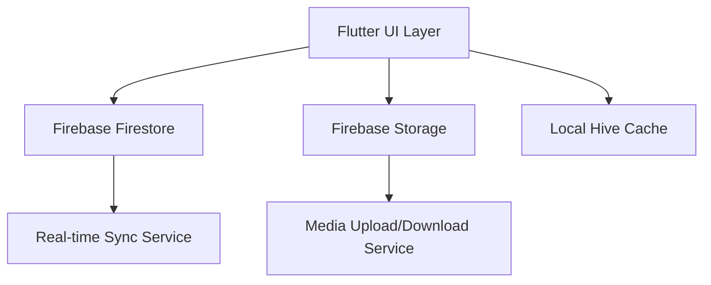

# Lightbox Media System Implementation Plan

## Core Requirements
- 🖼️ Media display component with gesture controls
- 🔁 Real-time synchronization across devices
- 💾 Persistent storage with Firebase Cloud Storage
- 📱 Offline-first capabilities with local caching

## Architecture Overview


## Phase Breakdown

### 1. UI Development (Flutteroo Developer)
- Implement lightbox widget with:
  - Gesture controls (zoom/pan)
  - Media type detection (images/video)
  - Loading states
- Create state management foundation

### 2. Firebase Integration (Flutteroo Developer)
- Configure Firestore for sync metadata
- Set up Storage buckets for media files
- Implement authentication layer
- Create sync service workers

### 3. State & Sync (Flutteroo Developer)
- Develop delta sync algorithm
- Implement conflict resolution
- Create offline queue system

### 4. Performance Optimization (Flutteroo Analyzer)
- Profile media loading times
- Audit network usage
- Recommend caching strategies

### 5. Documentation (Flutteroo Documenter)
- Create user guide for lightbox features
- Generate API docs for sync service
- Update architecture diagrams

## Dependencies
1. UI Prototype → Firebase Configuration
2. Sync Service → Performance Audit
3. All Phases → Documentation Updates

## Timeline
```mermaid
gantt
    title Implementation Timeline
    dateFormat  YYYY-MM-DD
    section Core Development
    UI Components       :2025-09-05, 5d
    Firebase Setup      :2025-09-08, 3d
    Sync Service        :2025-09-11, 7d
    section Quality
    Performance Audit   :2025-09-18, 4d
    Documentation       :2025-09-20, 3d