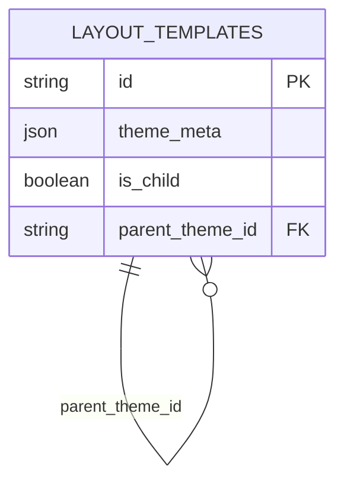

# Child Theme Implementation Guide

## Database Relationships


## Theme Loading Logic
```javascript
// In theme-manager.js
async loadTheme(themeId) {
  const theme = await getThemeFromDB(themeId);
  
  if (theme.parent_theme_id) {
    await this.loadTheme(theme.parent_theme_id);
  }
  
  // Apply overrides
  this.applyCSSOverrides(theme.styles);
  this.applyLayoutOverrides(theme.layout);
}

applyCSSOverrides(childStyles) {
  const parentStyles = document.getElementById('parent-styles');
  const childStyleTag = document.createElement('style');
  childStyleTag.id = 'child-styles';
  childStyleTag.textContent = childStyles;
  document.head.appendChild(childStyleTag);
}
```

## Child Theme Creation Flow
1. User selects "Create Child Theme" from parent theme
2. System copies parent theme assets
3. Lock parent theme elements (configurable)
4. Allow overrides of:
   - CSS variables
   - Component positions
   - Color schemes
   - Layout structure

## Override Rules
| Aspect       | Inheritance Rule                |
|--------------|---------------------------------|
| CSS Variables| Child values override parent    |
| Layout       | Merge with child precedence     |
| Assets       | Child files replace parent      |
| Components   | Added to parent structure       |

## API Endpoint Modifications
```javascript
// GET /themes/:id with inheritance
router.get('/themes/:id', async (req, res) => {
  const theme = await getTheme(req.params.id);
  if (theme.parent_theme_id) {
    theme.parent = await getTheme(theme.parent_theme_id);
  }
  res.json(theme);
});
```

## Validation Constraints
1. Max inheritance depth: 5 levels
2. No circular references
3. Parent themes can't be children of their descendants