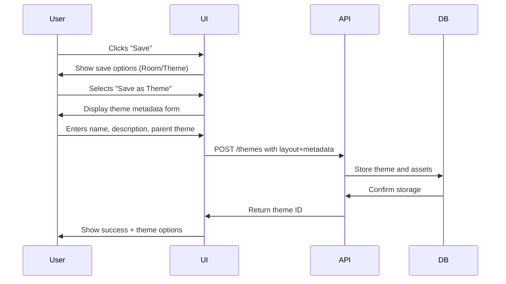

# Layout Builder Theme Integration

## Modified Save Flow



## Code Changes Required

**1. Add Theme Save Button** (`public/layout-builder.js`)
```javascript
// Add to existing save controls
const saveAsThemeBtn = document.createElement('button');
saveAsThemeBtn.className = 'btn btn-secondary';
saveAsThemeBtn.textContent = '💎 Save as Theme';
saveAsThemeBtn.addEventListener('click', handleThemeSave);
document.getElementById('saveControls').appendChild(saveAsThemeBtn);
```

**2. Theme Metadata Form** (New component)
```html
<!-- Add to layout-builder.html -->
<div id="themeForm" class="modal">
  <input type="text" id="themeName" placeholder="Theme Name" required>
  <textarea id="themeDesc" placeholder="Description"></textarea>
  <select id="parentTheme">
    <option value="">No parent theme</option>
  </select>
  <button onclick="submitTheme()">Save Theme</button>
</div>
```

**3. Modified Save Logic**
```javascript
async function submitTheme() {
  const themeData = {
    name: document.getElementById('themeName').value,
    description: document.getElementById('themeDesc').value,
    parent: document.getElementById('parentTheme').value,
    layout: JSON.stringify(components),
    assets: {
      'styles.css': generateCurrentCSS(),
      'layout.json': JSON.stringify(layoutConfig)
    }
  };

  try {
    const response = await fetch('/themes', {
      method: 'POST',
      headers: {'Content-Type': 'application/json'},
      body: JSON.stringify(themeData)
    });
    
    if (response.ok) {
      showThemeSuccess(await response.json());
    }
  } catch (error) {
    showError('Theme save failed: ' + error.message);
  }
}
```

## Validation Rules
1. Theme name must be unique
2. Parent theme must exist if specified
3. Layout must contain at least one component